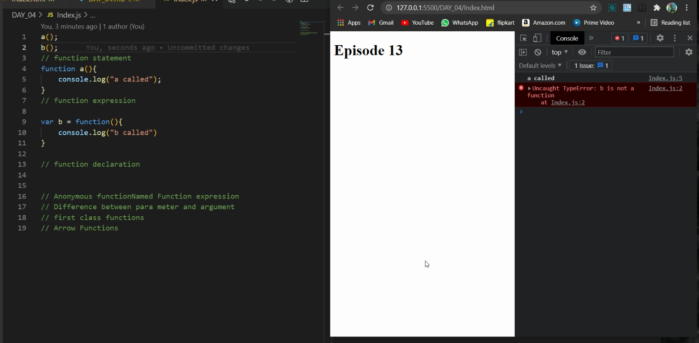
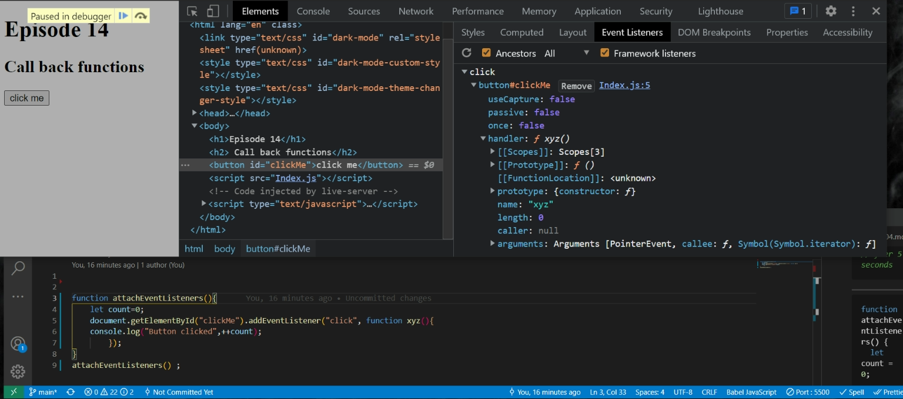
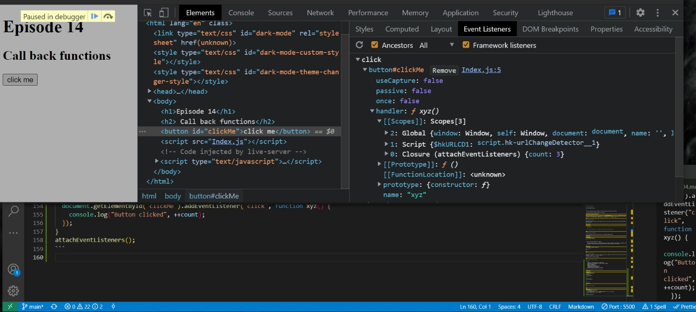

# Episode 13 First Class function ft. Anonymous Functions

## Today's Topics

    function statement
    function expression
    function declaration
    Anonymous functionNamed Function expression
    Difference between para meter and argument
    first class functions

<hr>

### Function statement

```javascript
   function a{
       console.log("a called");
   }
```

### Function Expression

```javascript
var b = function () {
  console.log("b called");
};
```

#### Index.js

```javascript
a();
b();
// function statement or function declaration
function a() {
  console.log("a called");
}

// function expression

var b = function () {
  console.log("b called");
};
```

> Difference between function ststement/ function declaration and function expression

- The major difference between these two is hoisting.



As we can see that the `function a()` works while the ` function b()` gives a `TypeError` because during the memory creation phase `'a'` is created the memory and whole function is assigned to `'a'` while on the other hand the `'b'` is treated like any other variable so it is present as `undefined` in the memory space. That's why when we recall the `b()` it gives _TypeError_

<hr>

### Anonymous Function

Anonymous function are used in a place where functions can be used as values like we used in previous example i:e
var b= function(){
}

#### Index.js

```javascript

    function (){

    }
    // This gives SyntaxError : function statement require a function name
```

<hr>

## Named Function Expression

If we give anonymous function a name like xy it will become named function.

#### Index.js

```javascript
var b = function xy() {
  console.log("b called");
};
```

> Difference between parameter and argument

    The values which we pass(1, 2) inside the functions are known as arguments and the labels or identifiers which gets those values are known as identifiers (param1 and param2).The parameters these are accessed locally in the function.

#### Index.Js

```javascript
var b = function (param1, param2) {
  // statements
};
b(1, 2);
```

<hr>

## First Class Function

The ability of functions to be used as values, passed to an argument as another function and can be returned from the function. This ability altogether is known as _`First class function`_

> Functions are first class citizens.

<hr>

## Episode 14 Callback functions

### Topics

    - What is a Callback functions in javascript?
    -Javascript is a synchronous and single-threaded language
    -Blocking the main thread
    -Power of  Callbacks
    -Deep about Event listeners
    -closures demo with event listeners
    -scope demo with event listener
    -garbage collection & remove event listeners

## What is a Callback functions in javascript?

#### Index.js

```javascript
setTimeout(function () {
  console.log("timer");
}, 5000);
function x(y) {
  console.log("x");
  y();
}

x(function y() {
  console.log("y");
});
```

#### Output

```javascript
x;
y;
timer; //after 5 seconds
```

<hr>

```javascript
function attachEventListeners() {
  let count = 0;
  document.getElementById("clickMe").addEventListener("click", function xyz() {
    console.log("Button clicked", ++count);
  });
}
attachEventListeners();
```

#### callback functions in Developer tools


    All scopes 

