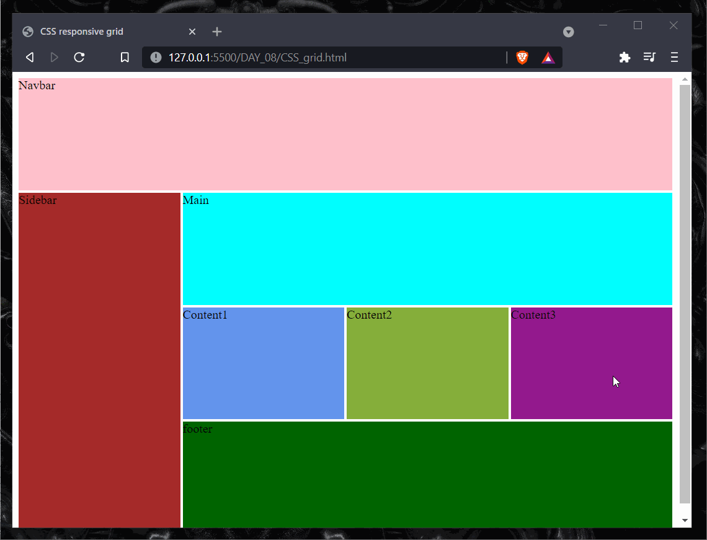
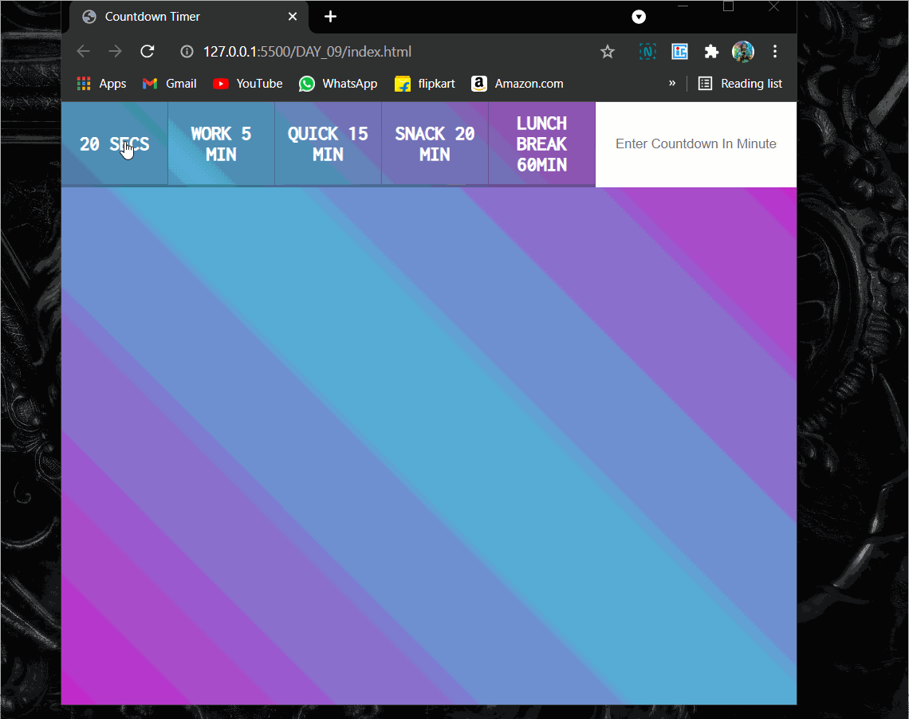
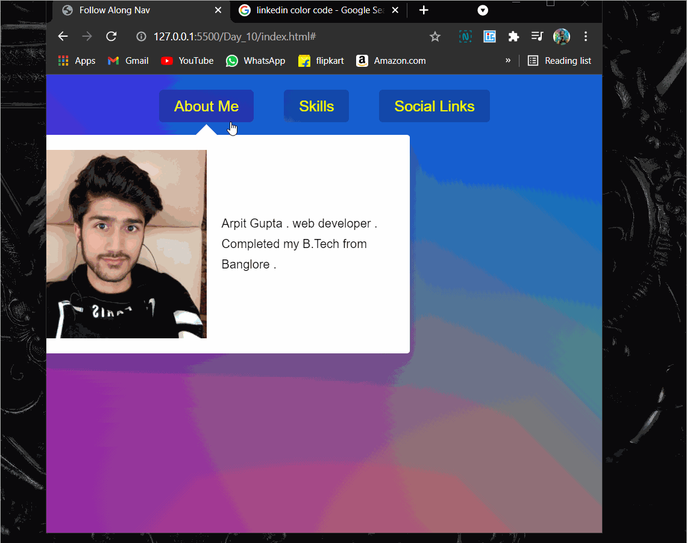
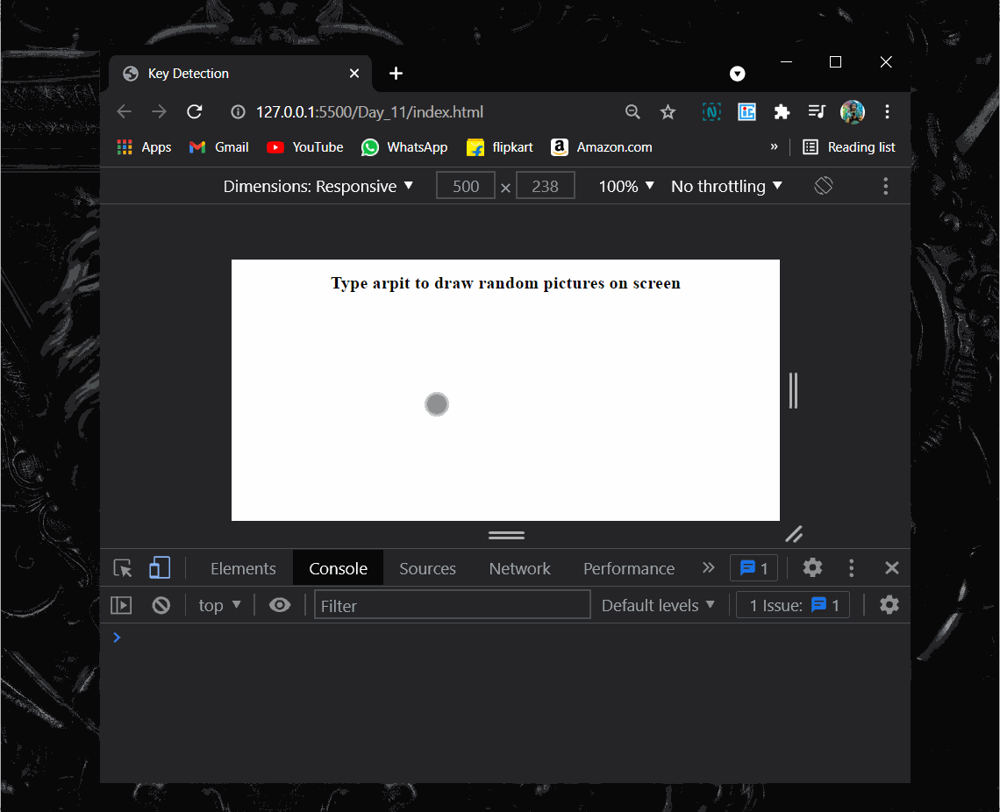
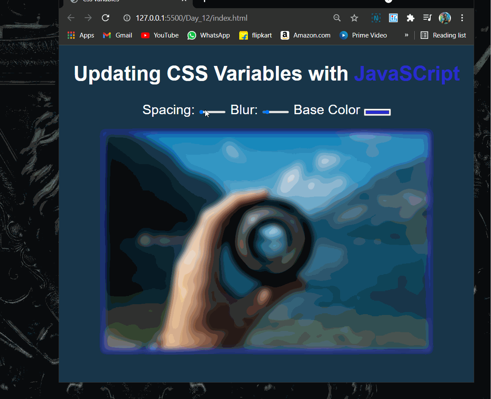

# 30DaysJavaScript

30 Days of JavaScript challenge

## DAY 1

Started my <i>Day 1</i> with the <b>Namastey JavaScript <b>

Watched first 7 videos in the playlist. Link to the playlist 👇  
<a href="https://www.youtube.com/playlist?list=PLlasXeu85E9cQ32gLCvAvr9vNaUccPVNP" >Namastey JavaScript </a>

</img>

## DAY 2

<i>Day 2</i> with the <b>Namastey JavaScript <b>

Watched another 5 videos in the playlist. Link to the playlist 👇  
<a href="https://www.youtube.com/playlist?list=PLlasXeu85E9cQ32gLCvAvr9vNaUccPVNP" >Namastey JavaScript </a>

  
 ## DAY 3

<i>Day 3</i>, Today i tried to solve some easy exercises on the _Exercism_ platform.

 
 Exercism is an online, open-source, free coding platform that offers code practice and mentorship on 50 different programming languages.

Link to the website 👇  
<a href="https://exercism.org/dashboard" >Exercism </a>

## Day 4

<i>Day 4</i> with the <b>Namastey JavaScript <b>

Watched another 2 Episodes in the playlist Episode 14 and Episode 15.

watch the topics covered in <a href="./DAY_04/DAY_04.md">DAY_04

-Link to the playlist 👇  

<a href="https://www.youtube.com/playlist?list=PLlasXeu85E9cQ32gLCvAvr9vNaUccPVNP" >Namastey JavaScript </a>

## Day 5

<i>Day 5</i> with the <b>Namastey JavaScript <b>

Completed the playlist ✔

-Link to the playlist 👇  

<a href="https://www.youtube.com/playlist?list=PLlasXeu85E9cQ32gLCvAvr9vNaUccPVNP" >Namastey JavaScript </a>

## Day 6

## Topics covered

<a href="https://developer.mozilla.org/en-US/docs/Web/JavaScript/Memory_Management"> Mark and sweep garbage collection algorithm</a>
 
<a href="https://gist.github.com/nitin42/4081f288f27cce79cde2bb38ebe70087"> mark and sweep implementation </a>
 
<a href="https://javascript.info/garbage-collection"> garbage collection </a>
 
<a href="https://blog.stackpath.com/v8-javascript-engine/"> V8 JS Engine </a>

## Day 7

clock with css and js

clock with jS and css

## Day 8

-Learnt about CSS grid and make basic CSS grid template design .
 
<a href="https://codepen.io/arpit0498/pen/eYRxWYm">CodePen link</a>

-After that created simple project of image gallery and applied js for generating html structure based on the page dimensions.

  
  ### resources
  <a href="https://www.w3schools.com/css/css_grid.asp">W3schools</a>
   
    <a href="https://css-tricks.com/snippets/css/complete-guide-grid/">CSS tricks</a>
   
    <a href="https://cssgrid.io/">CSSgrid.io</a>
   
## Day 9
  
  countdown timer

## Day 10

Drop down menu

## Day 11

Secret code for confirmation. Add
-Draw random images on screen on random places
-uses cornify_add

<a href="https://www.cornify.com/">Cornify</a>

<a href="./Day_11/index.html">Code Link </a>

## Day 12

CSS variable using js

<a href="./Day_12/index.html">Code Link </a>

## Day 13

Flex Image gallery

<a href="./DAY_13/">Code Link </a>

## Day 14

Sticky navigation using js

<a href="./DAY_14/">Code Link </a>

## Day 15

Shadow over mouse move!

<a href="./DAY_15/">Code Link </a>

## Day 16

reference vs copy
 
objects and arrays

### Resources:

 

video:

<li>
<a href="https://youtu.be/YnfwDQ5XYF4">reference vs copy</a>
</li>
Articles:
<li>
<a href="https://javascript.info/object-copy">object-copy</a>
</li>

<li>
<a href="https://developer.mozilla.org/en-US/docs/Web/JavaScript/Reference/Operators/Spread_syntax">Array Spread operator</a>
</li>
 

> #### Note : Spread doesn't work on objects in javascript

 

## Day 17

Throttling in JavaScript

### Resources

 

Video:

<a href="https://www.youtube.com/watch?v=81NGEXAaa3Y&list=PLlasXeu85E9eLVlWFs-nz5PKXJU4f7Fks&index=9">Throttling in Javascript</a>

 

## Day 18
